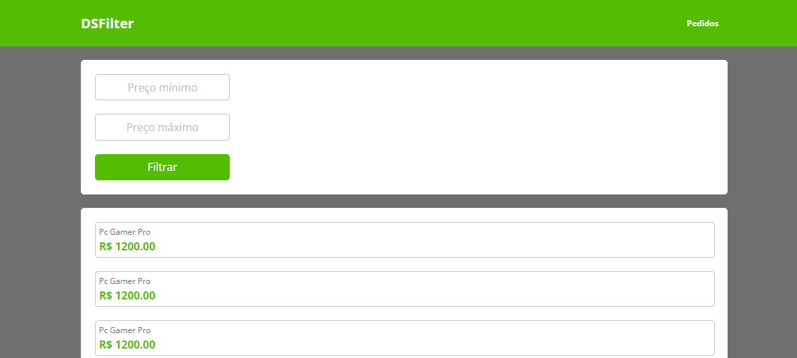

## React Events & Global State Challenge - ReactJS Professional - @devsuperior -
ReactJS Professional Challenge on Events & Global State
- Components
- Events Handling
- Yarn
- Vite
## _Table of contents_
- [Overview](#overview)
- [Screenshot](#screenshot)
- [Links](#links)
- [Built with](#built-with)
- [What I practiced](#what-i-practiced)
- [Continued development](#continued-development)
- [Resources](#useful-resources)
- [Author](#author)
- [Acknowledgments](#acknowledgments)
## _Overview_
The design is structured as shown:
- src|
    - assets|
    - components|
        - Header
          - index.tsx
          - styles.css
        - Home
        - ListingBody
          - FilterCard
          - ProductCard
    - dto
    - services
    - utils
    - routes
        - GoHome
   - App.tsx
   - index.css
   - main.tsx
   - index.html
   - tsconfig.json
   - tsconfig.node.json
   - vite.config.js
   - yarn.lock
- public|

## _Screenshot_
[]()
## _Links_
- Live Site URL: [] 
## _Built with_
||||||

 ## _What I practiced_
```jsx
import { BrowserRouter, Routes, Route } from "react-router-dom"
import GoHome from './routes/GoHome';
import { useState } from "react";
import { ContextProductCount } from "./utils/products-context";

function App() {

  const [contextProductCount, setContextProductCount] = useState<number>(0);

  return (
    <>
      <ContextProductCount.Provider value={{ contextProductCount, setContextProductCount }}>
        <BrowserRouter>
          <Routes>
            <Route path="/" element={<GoHome />}></Route>
          </Routes>
        </BrowserRouter>
      </ContextProductCount.Provider>
    </>
  )
}

export default App


``` 

## _Continued development_
- Next challenge: Moving forward 
### _Useful resources_
- [https://reactrouter.com/] React Router enables "client side routing".
- [https://reactjs.org] React lets you build user interfaces out of individual pieces called components!.
- [https://yarnpkg.org/] Open-source package manager used to manage dependencies in  JavaScript.
- [https://vitejs.dev/guide/] Build tool that aims to provide a faster and leaner development experience for modern web projects.
## _Author_
- Website - [https://ferreiras.dev.br] 
## Acknowledgments
- @devsuperior
